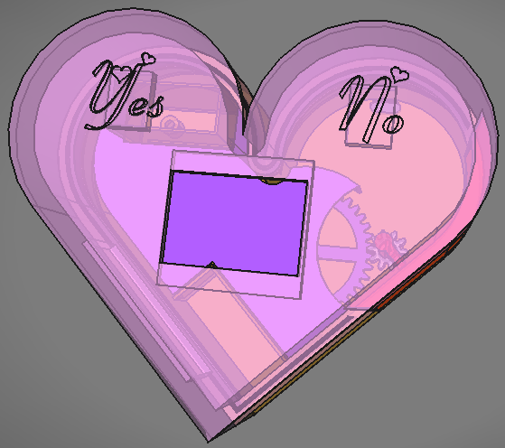
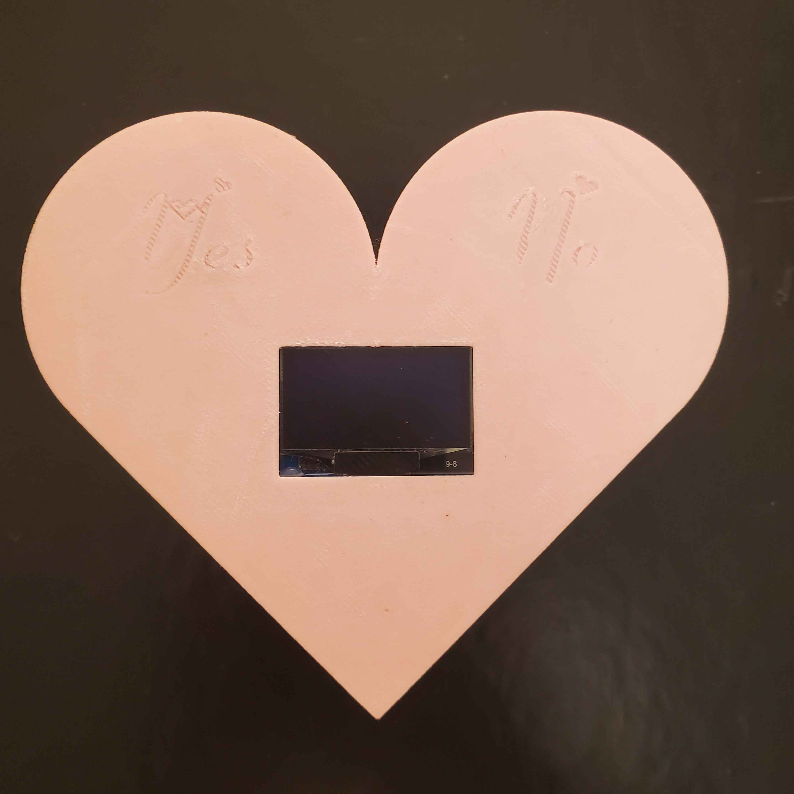
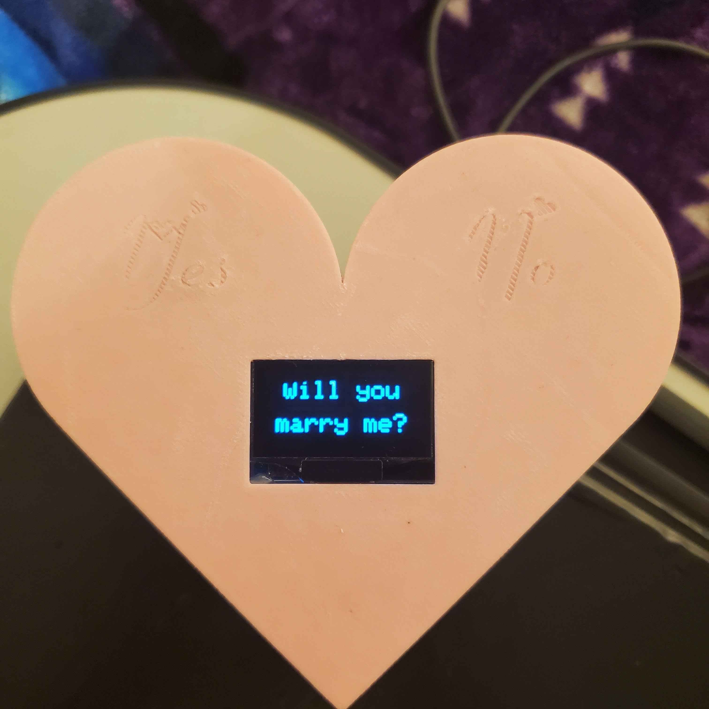

# MarryMeBox
This project was used to propose to my [now] fiance. 

You are free to use this project for their own engagement proposal if you wish. I strongly request you email me photos at kortheshells@gmail.com with the subject "MarryMeBox" or something similar. I would love to see photos of other happy couples!

## 3D Model
FreeCAD was used for 3D modeling of the project. Due to imprecisions with my 3D printer, each part is designed with a certain amount of tolerance in mind (typically .2mm). If your printer is more precise, you may have to increase the size of internal components for a better, less loose, fit.

While one theoretically could skip the usage of gears and directly link the servo motor to the swivel arm, I found that this left very little room for the internal components to sit comfortably. 

The font used for the text is "Fiolex Girls" and was found [here](https://www.dafont.com/fiolex-girls.font).

## Electronic Components
For the project, I used a 1.33" OLED display, an SG90 servo motor, two ttp223 touch sensors, and a female USB-C port. The controlling unit is an Arduino Nano Every.

Of course, you can certainly use buttons as opposed to a touch sensor, or a battery pack instead of a USB-C port. 

## Microcontroller and Code
This project was done using an Arduino Nano Every, using the Adafruit GFX library for displaying on the OLED. Bitmaps are used for drawing the images. Resource for creating Bitmaps can be found [here](https://javl.github.io/image2cpp/).

# Images and Media

https://github.com/user-attachments/assets/6c79e07c-60ec-47b3-b9be-c8a42adbd6d8

